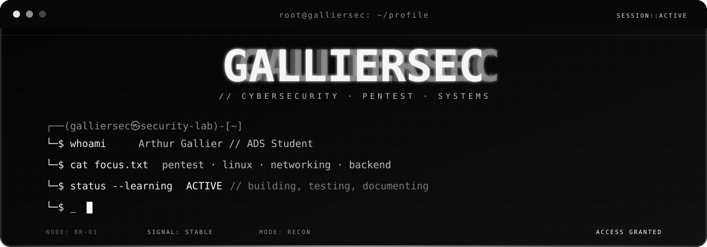

 

---

## `./perfil --mostrar`

---

## `./stack --verificado`

### `LINGUAGENS / SCRIPTING`

### `BACKEND / DADOS`

---

## `./ambiente --listar`

  

---

## `./roadmap --acompanhar`

---

## `ls ~/projetos`

---

## `./contribuicoes --snake`

<picture>
  <source media="(prefers-color-scheme: dark)" srcset="https://raw.githubusercontent.com/galliersec/galliersec/output/github-contribution-grid-snake-dark.svg">
  <source media="(prefers-color-scheme: light)" srcset="https://raw.githubusercontent.com/galliersec/galliersec/output/github-contribution-grid-snake.svg">
  
</picture>

---

## `./conexoes --abrir`

  

 

`© 2026 Arthur Gallier // GALLIERSEC`

