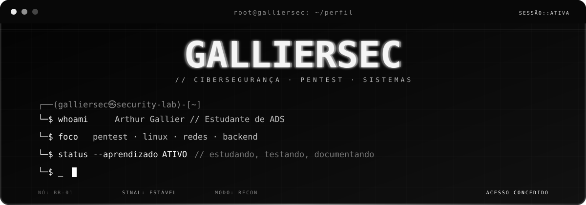

 

---

## Sobre mim

Sou **Arthur Gallier**, estudante de **Análise e Desenvolvimento de Sistemas** e atualmente direcionando meus estudos para **cybersecurity e pentest**.

Tenho interesse em entender sistemas além da interface: como se comunicam, como funcionam internamente, onde podem falhar e como podem ser analisados de forma segura.

> **Foco atual:** Linux, redes, fundamentos de segurança, pentest e automação.

---

## Tecnologias

---

## Ambiente de estudo

| Agora | Próximo passo | Explorando |
| --- | --- | --- |
| Linux e terminal | Projetos backend/API | Engenharia reversa |
| Redes | Labs de segurança | Análise de software |
| Fundamentos de segurança | Writeups técnicos | Automação |
| Metodologia de pentest | Projetos práticos |  |

---

## Roadmap

---

## Projetos

Ainda estou organizando os primeiros projetos públicos do perfil.

A ideia é usar este GitHub para publicar principalmente:

- laboratórios de segurança;
- estudos e writeups;
- scripts e automações;
- projetos relacionados a backend e redes.

`~/projetos -> preparando...`

---

## Contribuições

<picture>
  <source media="(prefers-color-scheme: dark)" srcset="https://raw.githubusercontent.com/galliersec/galliersec/output/github-contribution-grid-snake-dark.svg">
  <source media="(prefers-color-scheme: light)" srcset="https://raw.githubusercontent.com/galliersec/galliersec/output/github-contribution-grid-snake.svg">
  
</picture>

---

## Contato

  

`Entender. Analisar. Testar com responsabilidade. Aprender. Construir melhor.`

  

`© 2026 Arthur Gallier // GALLIERSEC`

